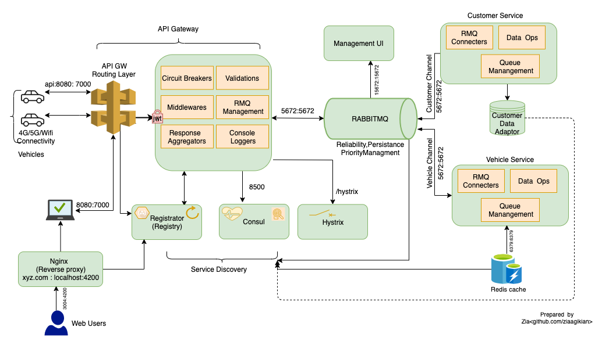
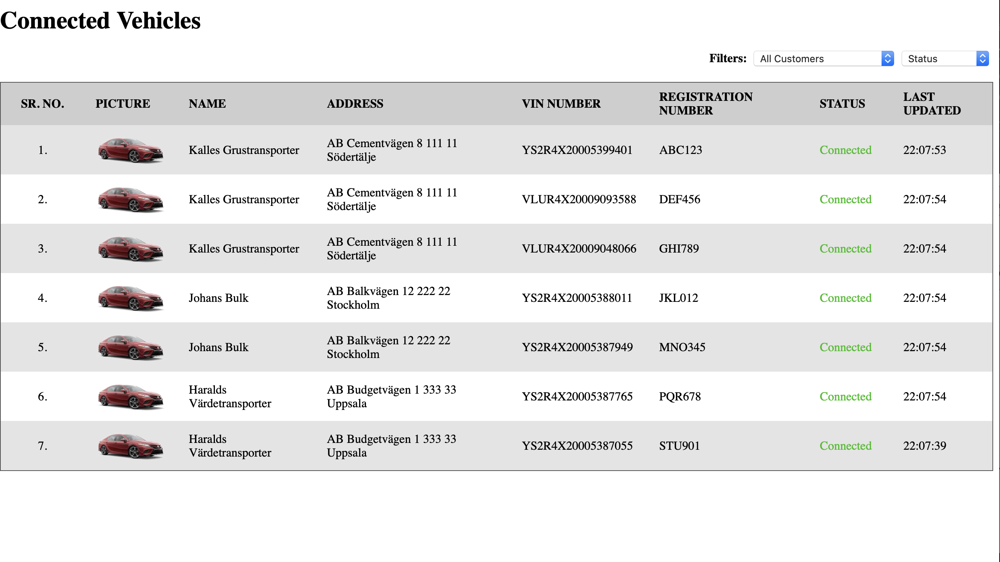

# ConnectedVehicles-Backend

Microservices based  End to End Dockerized Application to Connected Vehicles. 

## Microservice Based Architecture
Realtime backend solution is  developed using Nodejs technology with its most popular framework i-e ExpressJs. API Gateway aggregation Pattern is used this kind of requirement. Vehicle and web  app  users connect to the backend using api gateways. RabbitMQ is used for the internal communication between api gateway and the services. API service perform the  following major tasks.
1. Url Routing
2. Validation
3. Token based Security Mechanism i-e [JWT validation](https://jwt.io)
4. Response Aggregation
5. Console Logging
6. RMQ  Management 
7. Circuit Breaker 
8. Server based service Discovery
9. Service Registry
10. Health checks

Other services i-e Customer and Vehicle perform the following operations.
1. Database Setup
2. Event Logging
3. Data Operations
4. Response API gateway’s request
5. Queue Management
6. Register with Server Registry
7. RabbitMQ  Health Checks

 Architectural diagram is shown below. 

## Serverless Architecture

Proposed Serverless architecture is shown in the following diagram. 

This architecture is assumed to be developed using Microsoft techology Stack i-e Azure Cloud. *The number of databases and Azure functions [next to Api Gateway] are just pictorial presentation.*

## Frontend Application
An MVC based Angular application is developed for displaying Vehicle and customer information in  real time. The records can be filtered. Single Dashboard  API is exposed and filter information can be passed as HTTP Query Params. So in this way achieve API orchestration is achieved. Application refresh it self every *15 seconds* without disturbing GUI. The application can accessed using this [link](http://localhost:3004)

The application follows SPA paradigm. Popular Design Patterns like Dependency Injection, Observer, Factory etc are implemented. Nginx is used for reverse proxy.

 GUI snapshot is given below. 

## Integration Tests

Sample integration tests for APIs are written and can be found in [test directory](api-gateway/test/integration/vehicle-post-test.js). These are written in [chai framework](https://www.chaijs.com) and is coupled with [mocha framework](https://mochajs.org). These tests are dockerised and can be executed using [make script](Makefile) or docker compose. The commands are given below;

 `make test`

OR

`docker-compose run api-gateway  npm test`

The  tests are automated with  Travis CI pipelines.

## Docker  Support
The appliactions are fully dockerised and common docker attributes are implemented i-e Proper  hierarchy, dependencies and  automation is fully supported. The entire proecss, build steps are written in `docker-compose.yml`

[Make script](Makefile) is also written on the top of `docker-compose.yml` to build and run appliaction. Some of  the command are given below.
1. To run the application use `make run`
2. To build application use `make build`
3. For running fresh  instances of microservices and frontend app use `make reuild`
4. For integration test use  `make test`

Other useful commands are written in **`Makefile`** 

## Automation
The  projects are completely dockerised and automation can be achieved very easily.  These settings can  be reflected by setting  variable environment variable i-e  `NODE_ENV {dev/prod}` in Dockerfile. 

Github  and [Travis](https://travis-ci.org/ziaagikian)  are integrated are CI automation. Static code analysis is carried out  once commit is made on master repo. 
The multi stage  tarvis script  is developed. The travis job cycle is composed in `travis.yml` file

## Non Docker Build
The project can also be built with out Docker by customly install dependencies. This can be achieved using the following steps.
1. Install NodeJs and runtime build dependencies like npm and angular.
   MacOs users can use this command `brew install node`  and Linux users can execute this  command `sudo apt-get install node`
2. After successfull installation execute `sh ./non-docker.sh`